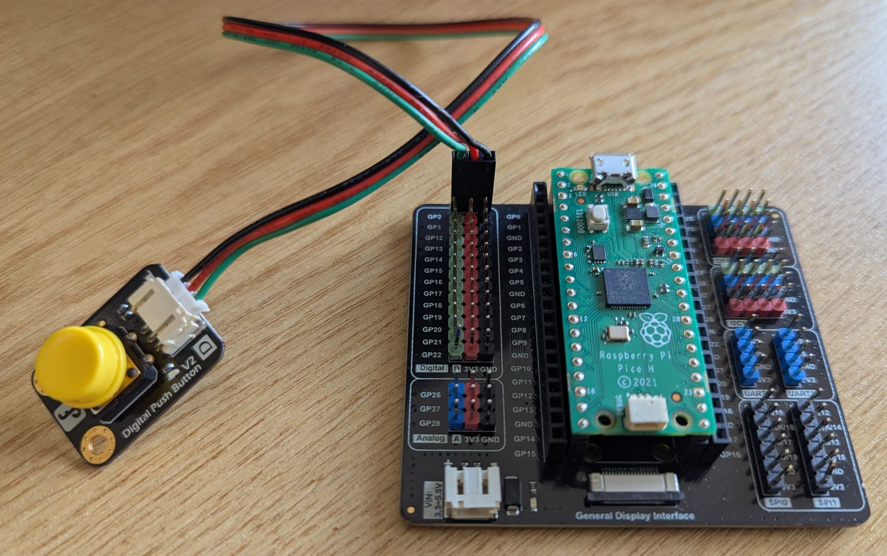

# Experiment Design and Setup

In this example we will build a simple reaction time / learning task. Subjects are presented with a sequence of visual stimuli. Each stimulus is associated with a target response delay, e.g.:

1. Gratings with temporal frequency = 1, target response delay = 1s
2. Gratings with temporal frequency = 2, target response delay = 2s

The goal of the subject is to respond with the correct response delay after each stimulus. For example, for condition 1. the subject must try to respond 1 second after the onset of the grating visual stimulus. After each trial, we will determine the difference between the subject's response delay and the target response delay and display it as feedback to the subject so that they can learn the association between stimulus and response delay.

### Hardware
To generate and display the visual stimuli we'll use BonVision and a standard computer monitor. To record response times we will initially use a [Harp Hobgoblin](https://harp-tech.org/tutorials/hobgoblin-setup.html) with a push button as it is already defined under the ucl-open standard. Later in the tutorial we'll explore how to integrate custom devices (e.g. Arduinos with specific firmware loaded). The wiring of the Hobgoblin is shown below and consists solely of a [DFRobot push button](https://www.mouser.co.uk/ProductDetail/DFRobot/DFR0029-G?qs=lqAf%2FiVYw9jLuRCJWa%252BNnA%3D%3D&mgh=1&vip=1&utm_id=20797887765&utm_source=google&utm_medium=cpc&utm_marketing_tactic=emeacorp&gad_source=1&gad_campaignid=20808116062&gclid=CjwKCAjw2rrQBhBuEiwAarLWHVR9RhfeKxF-73zBYq4O44iRltUhDcxb_UTrFDbUB_AAPgYv4aI6AhoCAjAQAvD_BwE) connected on pin GP2.

### Setup
We'll begin with a blank ucl-open project generated from the template, see [Building and Deploying](../building-deploying.md). You can call this project whatever you want, but for the purposes of this tutorial I will name and refer to it as `reaction-time`